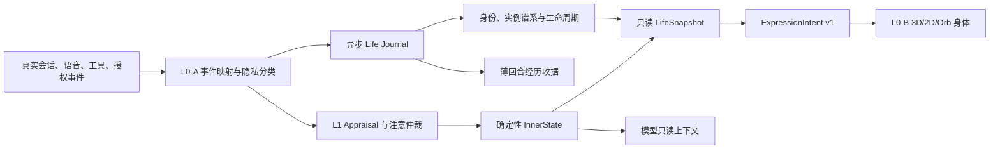

# Javis Life OS 综合执行计划

**日期：** 2026-08-12
**状态：** 执行中
**实现基线：** `eeebcbd`
**实现分支：** `codex/javis-life-os-l0-foundation-20260812`
**实现工作区：** `G:\Javis\.codex\worktrees\javis-life-os-l0-foundation-20260812`

## 1. 目的与依据

本计划把已经审阅通过的 Life OS 总体规格、L0-A 生命内核、L0-B 基础精致 3D 身体、L1 临场感与内稳态规格收束为一条可执行主线。它不改写这些规格的产品判断，而是补齐实施状态、依赖、并行边界、证据门、失败回退和当前工作包。

事实优先级固定为：用户最新决定 -> 当前源码与测试证据 -> 已审阅规格 -> 本执行计划 -> 历史技术计划。

当前确认的硬性产品决定包括：

1. Javis 的主线是同一身份的持续存在，不是 Agent、模型和工具数量增长。
2. 生命内核与基础身体双轨推进，身体只消费经过治理的表达意图，不成为第二状态权威。
3. L1 采用单写者、事件派生、确定性的内在状态内核；模型只读，不可写状态。
4. 精确呼唤“Javis/Jarvis/贾维斯”时由本地确定性回应“我在”，不依赖模型；完整请求继续正常对话。
5. 不保存原始语音，不用随机动画或夸张情绪伪造生命，不因关系提高权限。

## 2. 源码区与工作区规则

### 2.1 区域定义

| 区域 | 路径 | 权限与用途 |
|---|---|---|
| 正式源码区 | `G:\Javis` | 本轮只读；保留现有语音/模型修复，不写 Life OS 文件 |
| Life OS 工作区 | `G:\Javis\.codex\worktrees\javis-life-os-l0-foundation-20260812` | 本轮唯一代码、文档和测试编辑区 |
| 历史冻结区 | `G:\Javis-worktrees\javis-life-os-master-v3` | 只读参考；冻结在 `eeebcbd` |
| 临时区 | 当前工作区下 `.tmp` | 测试临时文件；运行测试时显式设置 `TEMP/TMP` |
| 用户验收区 | `D:\Javis` 或最终安装位置 | 只安装和真实用户验收，不现场修改安装文件 |
| 系统盘 | `C:` | 不存放 Javis 源码、依赖缓存、构建缓存或测试数据 |

### 2.2 Git 与集成

1. 本轮所有改动只提交到 `codex/javis-life-os-l0-foundation-20260812`。
2. 在工作区完成自动化证据前，不合并回 `G:\Javis`。
3. 合并前先解决 `G:\Javis` 当前语音/模型修复线，重新基于正式集成点验证。
4. 不从工作区直接生成正式安装包；打包必须由用户另行授权并从已集成的正式源码提交产生。
5. D 盘发现的问题必须在工作区复现、修复、测试，再重新构建安装；禁止修改已安装文件冒充修复。

### 2.3 依赖与网络

当前 L0-A 只使用现有依赖。L0-B Task 1 涉及 Three.js/VRM 依赖时必须暂停，列出精确版本、缓存位置和体积，并取得用户明确下载许可。未经许可不得执行 `npm install`、`pnpm install`、`pip install`、模型下载或远程素材获取。

## 3. 当前真实基线

| 能力 | 状态 | 证据 |
|---|---|---|
| P0/P1 安装、对话、语音、模型与发布基线 | 已归档 | Life OS 总体规格及现有回归 |
| Life OS 总体规格 | 已审阅通过 | `c895f960` |
| L0-A/L0-B 子规格 | 已完成 | `7b69f51c` |
| L0-A/L0-B 实施计划 | 已完成并加固 | `ae0b8f87` 至 `537cff9c` |
| L1 确定性临场感规格 | 已完成 | `f73c6af0` |
| L0-A Task 1 不可变契约 | 已实现 | `eeebcbd`，257 项契约测试通过 |
| L0-A Task 2 数据根隔离 | 已完成 | 当前工作包 `WP-A02`；770 tests + 28 subtests |
| L0-A Task 3 身份宪章存储 | 已完成 | `IdentityConstitutionStore`；792 tests + 28 subtests |
| L0-A Task 4 实例谱系与连续性 | 已完成 | 启动顺序、异常关闭、复制分叉及恢复已验证 |
| L0-A Task 5 生命周期与表达投影 | 已完成 | 状态转换、终态保护、九态表达和过期语义已验证 |
| L0-A Task 6 隐私分类与事件映射 | 已完成 | 27 项聚焦测试；完整回归 859 tests + 28 subtests |
| L0-A Task 7-12 | 未开始 | 必须按依赖顺序推进 |
| L0-B Task 1-10 | 未开始 | Task 1 等待下载许可；Task 6 等待 L0-A Task 11 |
| L1 产品实现 | 未开始 | 依赖 L0-A 纵切与表达桥 |

`eeebcbd` 是实现起点，不是完整 L0-A 完成点。现有 `core/life/contracts.py` 只冻结数据边界，不代表身份持久化、生命周期、日志、API、前端桥或 L1 内稳态已经实现。

## 4. 总体交付架构

单写者边界：

- 身份宪章只由 `IdentityStore` 的审计迁移接口写入。
- 生命周期快照只由 `LifeService` 内的状态机写入。
- L1 内在状态只由确定性 reducer 写入。
- 身体、模型、前端和工具均为只读消费者。
- 关系、熟悉度和表达强度不能进入授权决策。

## 5. 集成阶段

### Phase A0：生命基础纵切

目标：一次启动能够在独立数据根创建或读取同一身份，识别实例连续性，生成可解释的安静快照和表达意图，并干净关闭。

顺序：

1. Task 1 契约冻结，已完成。
2. Task 2 代码根/数据根隔离。
3. Task 3 身份宪章原子存储。
4. Task 4 实例谱系与连续性检查点。
5. Task 5 生命周期状态机和 ExpressionIntent 投影。

出口证据：首次出生、正常重启、异常重启、损坏恢复、代码根零写入、同一身份重载、过期表达不恢复。

### Phase A1：真实事件与异步生命日志

目标：现有会话、语音、工具和授权事件经过白名单映射与脱敏后进入异步日志，不阻塞会话热路径。

顺序：Task 6 -> Task 7 -> Task 8。

出口证据：来源事件真实存在；secret/biometric 不落盘；幂等；队列过载可降级；慢 SQLite 不阻塞 handler；关闭时有界排空。

### Phase A2：只读运行面与兼容桥

目标：桌面关闭由所有权握手管理，后端只读 API 和 WebSocket 推送 LifeSnapshot，前端严格校验并兼容映射到当前表面状态。

顺序：Task 9 -> Task 10 -> Task 11 -> Task 12。

出口证据：无生命状态写 API；旧事件链不重复；过期 revision 被拒绝；前端断线降级；发布、恢复与隐私合同锁定。

### Phase B0：基础身体壳

目标：在不改写 Pet 交互的前提下提供透明、轻量、可处置、可降级的 3D 身体容器和零资产 Lightform。

顺序：L0-B Task 1 -> 2 -> 3 -> 4 -> 5。Task 1 先过网络许可门。

出口证据：锁文件一致、资源离线、许可和哈希完整、透明窗口正确、销毁无残留 RAF/监听器、Pet 拖拽与菜单不回归。

### Phase B1：身体表达闭环

目标：身体只消费 L0-A 的 12 字段 ExpressionIntent，完成九态映射、单写者动作混合、诚实口型、打断、性能治理与多级 fallback。

顺序：L0-A Task 11 集成后执行 L0-B Task 6 -> 7 -> 8 -> 9 -> 10。

出口证据：陈旧/过期意图不应用；打断立即清口型；WebGL 丢失不复活旧 speaking；低性能自动降级；视觉候选经用户选择后才成为默认身体。

### Phase L1：第一个“活着时刻”

目标：接入真实观察、确定性评估、注意仲裁、内稳态衰减、精确呼名本地回应和薄回合经历收据。

实施批次：

1. `LifeObservation`、`InputProvenance`、`VoiceTurnRegistry` 与序列合同。
2. Appraisal reducer、Attention arbiter、InnerState reducer 与虚拟时钟测试。
3. 精确呼名判定和本地“我在”播放；完整请求、重复事件和打断去重。
4. 模型只读上下文与禁止写工具扫描。
5. 薄回合经历收据、重启清理与保留策略。
6. ExpressionIntent 联动、故障降级、五道证据门和真实用户闭环。

L1 不得提前实现 L2 自传记忆、关系成长、持续人格或模型可写情绪。

## 6. 依赖与文件所有权

| 共享面 | 首个所有者 | 后续规则 |
|---|---|---|
| `core/runtime.py` | L0-A Task 2/8 | L1 只能在 A2 集成后扩展 `LifeService`，不可旁路装配 |
| `main.py` | L0-A Task 10 | L1 API 与精确呼名接线先 rebase，不创建第二 runtime |
| `app/src/main.ts` | L0-A Task 11 | L0-B Task 7/9 和 L1 前端接线必须在其后 |
| `app/src/life/*` | L0-A Task 11 | L0-B 导入同一守卫，禁止复制协议 |
| `package*.json`、`pnpm-lock.yaml` | L0-B Task 1 | 精确版本一次提交，三份锁证据一致 |
| `ExpressionIntent v1` | L0-A Task 1 | 字段、枚举、时间和 revision 语义冻结；变更必须版本升级 |
| Life Journal | L0-A Task 7 | L1 经映射器追加观察/收据，不另建平行事实库 |

同一文件不可在两个未集成工作包中并行修改。并行只允许发生在文件所有权不重叠且依赖合同已提交的工作包之间。

## 7. 工作包台账

| ID | 内容 | 依赖 | 状态 |
|---|---|---|---|
| WP-A01 | 不可变生命契约 | 无 | 完成，257 tests |
| WP-A02 | 数据根解析与运行时存储迁移 | A01 | 完成；沿用仓库同步关闭测试模式，不引入 pytest-asyncio；完整回归通过 |
| WP-A03 | 身份宪章存储 | A02 | 完成；版本链、原子写、显式回滚、审计与只读恢复已验证 |
| WP-A04 | 实例谱系和连续性 | A03 | 完成；810 tests + 28 subtests |
| WP-A05 | 生命周期与表达投影 | A03、A04 | 完成；836 tests + 28 subtests |
| WP-A06 | 隐私映射 | A05 | 完成；27 focused tests；859 tests + 28 subtests |
| WP-A07 | 异步 Journal | A06 | 待执行 |
| WP-A08 | LifeService 装配 | A07 | 待执行 |
| WP-A09 | 所有权关闭 | A08 | 待执行 |
| WP-A10 | 只读 API/推送 | A08、A09 | 待执行 |
| WP-A11 | TypeScript 兼容桥 | A10 | 待执行 |
| WP-A12 | 恢复/隐私/发布合同 | A11 | 待执行 |
| WP-B01 | 3D 依赖与锁文件 | 用户下载许可 | 阻塞于许可门，不是技术失败 |
| WP-B02-B05 | Manifest、Surface、Lightform、Pet 集成 | B01 | 待执行，可在 A02-A10 期间独立分支推进 |
| WP-B06-B10 | 表达、口型、性能、预览、验收 | A11、B05 | 待执行 |
| WP-L101-L106 | L1 六个实施批次 | A08/A11，部分依赖 B06 | 待执行 |

## 8. 测试与证据矩阵

| 层级 | 每工作包 | 阶段出口 | 集成出口 |
|---|---|---|---|
| Python 纯逻辑 | 定向单测、确定性时钟、严格反序列化 | `tests/test_life_*.py` 与关联 runtime tests | 全量 Python 回归 |
| Python 集成 | 真实 EventBus、SQLite、runtime 装配 | 慢 I/O、异常关闭、损坏恢复 | 会话、语音、权限回归 |
| TypeScript | wire guard、revision、surface 映射 | 完整 App tests | TypeScript check + production build |
| Rust/Tauri | 所有权、环境变量、关闭握手 | Rust tests | 集成构建后再验证 |
| 视觉 | deterministic preview | 3D/2D/Orb、缩放、背景 | D 盘 WebView2 真机证据 |
| 隐私 | payload allowlist、禁止字段扫描 | 数据库样本审计 | 安装/重启/导出/删除检查 |

所有测试临时文件必须进入工作区 `.tmp` 或 pytest `tmp_path`。自动测试通过不等于 D 盘真实安装验收通过；未执行的真机项明确标记 `NOT RUN`。

## 9. 五道实施门

1. **合同门：** 字段、枚举、版本、hash、revision 和隐私分类由测试冻结。
2. **事实门：** 每个映射源都必须能在当前 EventBus/ConversationHub/语音链中找到真实发布者。
3. **热路径门：** 会话 handler 不执行同步 SQLite、资源下载或重型状态计算。
4. **降级门：** 身份与连续性失败要显式进入恢复；3D 和模型失败只能降级表达/推理，不能改身份。
5. **用户闭环门：** 合并、构建、D 盘安装、真实麦克风、离线模型、打断、重启与 fallback 全部有可追溯证据。

任何门失败时，只回退当前工作包，不降低合同、隐私或安全要求来换取测试通过。

## 10. 当前迭代

本轮只交付基础工作，不修改正式源码区，不构建安装包：

- [x] 从 `eeebcbd` 创建独立 `codex/` 工作区。
- [x] 复验 Task 1 契约。
- [x] 建立综合执行计划和区域规则。
- [x] 完成 WP-A02 数据根隔离的红绿测试。
- [x] 运行 WP-A02 定向回归、完整 Python 回归和 `git diff --check`。
- [x] 核验 `G:\Javis` 主工作树内容状态与本轮开始时一致。

## 11. 完成定义

Life OS 不能因“文件已创建”或“界面会动”被标记完成。阶段完成必须同时满足：

1. 规格中的合同和非目标没有被绕过。
2. 自动化证据覆盖正常、错误、恢复、并发、隐私和降级路径。
3. 工作区改动形成可审查提交，且无未解释的生成物或缓存。
4. 正式源码区只通过明确集成动作接收已验证提交。
5. 需要下载、视觉选择、打包或 D 盘验收的门已由用户明确授权并真实执行。
6. 每个未完成项保持真实状态，不用“基本完成”替代缺失证据。
