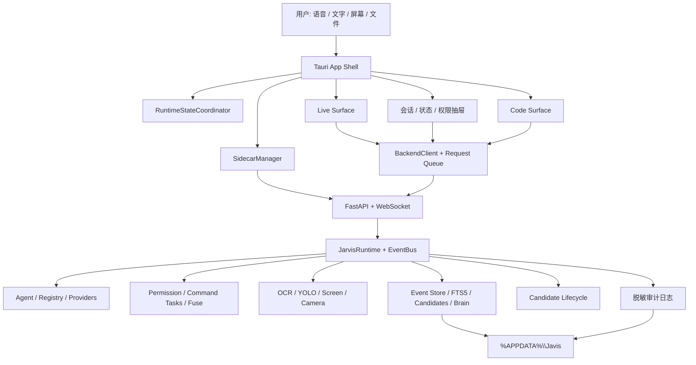

# Javis App V1 总体设计规格

日期: 2026-07-27  
状态: 用户已授权自动执行 Phase 2/3/4  
适用范围: Windows 第一版桌面 App  
技术基线: Tauri v2 + TypeScript + Vite + Python FastAPI/WebSocket sidecar

## 1. 目标

第一版 Javis App 必须把当前已经存在的 Agent、语音、记忆、感知、权限和工作区能力，收束成一个稳定的桌面产品入口。

它打开后首先是一个可交流的 Live 智能体，不是聊天网页，也不是代码编辑器。中心 Live Orb 是第一视觉信号；语音是主入口；文字输入是可靠的后备入口；Code Surface 只在编程、文件、终端任务或用户主动召唤时出现。

第一版的判断标准不是“功能全部堆进首页”，而是以下闭环稳定成立:

```text
启动 App
  -> 检查或启动本地后端
  -> 显示真实在线状态
  -> 接收语音或文字
  -> 显示 listening/thinking/executing/speaking 等状态
  -> 必要时请求权限
  -> 返回结果并写入会话/事件记录
  -> 后端异常时可诊断、重连或安全退出
```

## 2. 不可变更要求

以下要求来自已有 App 蓝图、Live Cockpit 设计和用户确认。后续实现不得回退:

1. 首页必须是 Siri-like Live Orb，不是 Code workspace。
2. Live Orb 必须随 `idle`、`listening`、`thinking`、`speaking`、`executing`、`blocked`、`error`、`offline` 状态变化。
3. 语音是主交互入口，文字输入始终可用。
4. Code Surface 默认隐藏，只在任务需要或用户主动打开时出现。
5. 现有 Python 后端能力必须保留，App 通过 FastAPI/WebSocket 接入。
6. `web/` 必须保留为调试、回归和旧 UI 参考入口，不再作为主产品入口。
7. App 本体不得打包 `venv/`、`Lib/`、`python-embed/`、模型、数据集、Git 历史和运行缓存。
8. 模型、记忆、日志、缓存和工作区必须与 App 安装目录分离。
9. 未经用户明确批准，不执行依赖下载、模型下载或安装命令。
10. Windows 是第一目标平台，第一版必须支持窗口缩放、托盘常驻和异常恢复。
11. 视觉保持 JARVIS/Iron-Man 气质: 深色背景、青色与紫色能量层、中心动态核心、克制的全息信息层。
12. UI 不能因长文本、流式输出、窗口缩小、状态变化或按钮标签而发生重叠、跳动或溢出。

## 3. 当前真实基线

### 3.1 已完成

- `app/` Tauri/Vite/TypeScript 工程骨架已经存在。
- `app/preview.html` 可在不安装 Node/Rust 依赖时预览 Live Orb。
- `app/src/live/liveState.ts` 已定义 8 个 App 状态。
- `app/src/bridge/backendClient.ts` 已连接 `/ws` 和 `/api/status`。
- `app/src/live/VoiceCapture.ts` 已通过 MediaRecorder 接入现有 `voice` WebSocket 协议。
- `scripts/start_javis_app.py` 已能优先打开 App 预览并尝试启动现有后端。
- `scripts/app_package_manifest.py` 已定义打包包含、排除和外置边界。
- App 包装静态测试共 13 项，2026-07-27 已验证通过。
- 测试模式下 Kernel、Control、Perception、Memory、Evolution 五个蓝图系统均已挂载并报告 `running`；App 端仍需把这些能力接入产品界面。
- Cron、26 类错误分类、Hooks、沙箱、Gateway、FTS5、模型切换和自动更新能力已经存在。

### 3.2 当前仍是原型的部分

- 顶部只有固定状态文字，没有可收起的状态栏或系统详情。
- Live 状态由多个模块直接写 DOM，缺少统一状态协调器，异步事件可能互相覆盖。
- Code Surface 只是占位层，没有真实文件树、编辑器、终端和任务日志。
- Sidecar 尚未由 Tauri 正式管理，缺少进程归属、崩溃重启和退出清理。
- WebSocket 重连使用固定延迟递归发送，缺少发送队列、上限、退避和取消机制。
- 流式文本只写入一行 caption，长回答、Markdown、代码和历史消息没有稳定承载面。
- FTS5 搜索 API 已完成，但 App 中没有会话/记忆搜索交互。
- 权限按钮没有连接 `safe/trusted/root` 状态、确认队列或审计记录。
- 屏幕按钮没有连接感知 API，也没有隐私提示和采集状态。
- Tauri 尚未完成真实构建，因为 Node/Rust 环境未确认且未获依赖安装批准。

## 4. 三套架构融合后的差距判断

### 4.1 第一版 App 阻塞项

| 差距 | 来源 | 为什么阻塞第一版 | V1 处理方式 |
|---|---|---|---|
| 显式状态协调器 | Claude 状态机 | 语音、WebSocket、工具和健康检查会抢写状态 | App 建立单一 `RuntimeStateCoordinator`，后端保持事件源 |
| Sidecar 生命周期 | App 蓝图 | 用户不能依赖手工启动 Python | Tauri 管理 launcher，包含探测、启动、重连、停止、日志 |
| Audited terminal 的 App 接入 | Blueprint Control | 后端受控命令任务已存在，但 Code Surface 仍是占位界面 | Code Surface 只调用受控命令任务并显示审计状态、输出和退出码 |
| 权限确认闭环 | Blueprint Control | `blocked` 状态不能只是动画 | 权限抽屉显示风险、参数、影响和允许/拒绝操作 |
| 速率限制 | Claude 安全模型 | 点击、发送、桌面操作可能短时重复触发 | UI 防抖 + 后端按工具/会话限流，越限 fail-closed |
| 数据隐私边界 | Claude 安全模型 | 屏幕、相机、麦克风涉及敏感数据 | 默认不持久化原始媒体，只存结构化事件和明确授权的附件 |
| 自适应 Live UI | 用户要求 | 当前最小高度和固定布局会在小窗口溢出 | 建立窗口断点、稳定轨道、文本换行和抽屉规则 |
| 可靠消息桥 | App 蓝图 | 当前断线重发可能无限递归 | 有界队列、指数退避、去重、超时和可取消请求 |
| 会话与记忆入口 | Claude 自检 | 搜索 API 已有但 UI 缺失 | 左侧抽屉提供历史、FTS5 搜索和记忆来源 |
| Code Surface 实体化 | App 蓝图 | 当前只是视觉占位 | 接入 workspace API、审计终端、文件查看和任务日志 |

### 4.2 第一版发布质量项

这些工作不一定影响 Live 首页启动，但在 V1 对外使用前必须完成:

- Code Review 请求与反馈处理流程，补齐 Codex 两个工作流缺口。
- 完成前独立验证步骤，不能只依赖 Agent 自我反射。
- 崩溃日志脱敏、日志轮换和诊断包导出。
- Tauri CSP、能力权限、签名和安装包边界检查。
- 键盘导航、屏幕阅读器标签、对比度和减少动画模式。
- 首次启动向导必须说明本地数据路径、模型路径和隐私默认值。

### 4.3 V1 后继续，不阻塞第一版

- `run_subagent` 深度集成 Agent 主循环。
- 显式 `/learn` 命令入口。
- 统一 ThreadPool 管理器。
- 进化候选的 App 审核与诊断界面。
- 数字人和悬浮投影形态。

这些能力保留在蓝图中，但第一版不得为它们增加首页噪音或扩大打包体积。

## 5. 总体架构



### 5.1 App Shell

App Shell 只负责窗口、路由、托盘、全局快捷键、Sidecar 进程和顶层错误边界。它不直接实现 Agent 逻辑。

建议文件边界:

```text
app/src/
├─ app/
│  ├─ AppController.ts          # 顶层启动、Surface 切换、错误边界
│  └─ AppPreferences.ts         # 窗口/UI 偏好，本地持久化
├─ state/
│  ├─ RuntimeStateCoordinator.ts# 唯一状态写入口
│  └─ runtimeStateTypes.ts      # 状态、来源、优先级、事件类型
├─ bridge/
│  ├─ backendClient.ts          # WebSocket/HTTP 协议
│  ├─ requestQueue.ts           # 有界发送队列、去重、取消
│  └─ sidecarClient.ts          # Sidecar 状态映射
├─ live/
│  ├─ LiveStage.ts              # Live 页结构
│  ├─ LiveOrb.ts                # Orb 视觉映射
│  ├─ LiveCaption.ts            # 短字幕与展开规则
│  └─ CommandComposer.ts        # 自适应文字输入与语音按钮
├─ panels/
│  ├─ StatusRail.ts             # 可收起状态栏
│  ├─ ConversationDrawer.ts     # 历史与搜索
│  ├─ ControlDrawer.ts          # 权限、感知、设置
│  └─ TaskStream.ts             # 工具执行过程
└─ code/
   ├─ CodeSurface.ts            # Code 页面路由与布局
   ├─ FileExplorer.ts           # 工作区文件树
   ├─ EditorPane.ts             # 文本/代码查看与编辑
   └─ TerminalPane.ts           # 审计命令任务与输出
```

继续使用原生 TypeScript 和现有 CSS，不在 V1 中引入前端框架迁移。

### 5.2 Python Sidecar

SidecarManager 必须实现以下状态:

```text
unknown -> probing -> starting -> healthy
                         |          |
                         v          v
                       failed <- degraded
                                      |
                                      v
                                  restarting
healthy -> stopping -> stopped
```

规则:

- 启动前先检查 `127.0.0.1:8080/api/status`。
- 若端口已有健康 Javis，连接现有实例，不重复启动。
- 若端口被非 Javis 进程占用，显示明确冲突，不杀死未知进程。
- 启动后在限定时间内轮询健康检查；失败时保留最近错误摘要。
- 崩溃重启使用有上限退避，连续失败后进入 `failed`，等待用户操作。
- App 只停止自己启动的 Sidecar，不停止用户原本运行的后端。
- stdout/stderr 分流写入 `%APPDATA%\Javis\logs\runtime`，敏感字段脱敏。
- App 退出、重启、Windows 注销时执行安全停止；强制退出不阻塞 UI 无限等待。

### 5.3 Backend 与 Runtime

- `main.py` 继续向薄入口演进，路由拆分到 `api/`，但不为 App 重写内核。
- `/api/status` 用于轻量存活检查。
- `/api/runtime/status` 提供模型、权限、工具数、子系统健康和事件摘要。
- `/api/blueprint/coverage` 提供五系统覆盖证据，只在诊断视图显示。
- `/ws` 是 Live 交互主通道。
- 工具、权限、记忆、感知和进化事件统一进入 EventBus，App 不从日志文本猜状态。

## 6. 状态协调器详细设计

### 6.1 状态映射

Claude 的内部状态机与 App 的 8 个可视状态按下表映射:

| 内部状态/事件 | App 状态 | 可视行为 |
|---|---|---|
| SLEEP、无活动 | `idle` | Orb 慢呼吸，状态栏显示待命 |
| LISTEN、录音开始 | `listening` | 外环跟随输入能量，麦克风高亮 |
| THINK、请求已发送 | `thinking` | 环向内收束，紫色节奏加快 |
| ACT、OBSERVE、tool_start | `executing` | 外环锐化，出现任务进度条 |
| SPEAK、text/audio delta | `speaking` | Orb 向外脉冲，字幕流式更新 |
| permission request | `blocked` | 琥珀色，权限抽屉自动出现 |
| 可恢复异常 | `error` | 显示错误摘要和重试操作 |
| 连接断开/Sidecar 不健康 | `offline` | Orb 降饱和，输入进入排队或禁用 |

### 6.2 唯一写入口

所有模块只能向 `RuntimeStateCoordinator` 提交事件，不能直接修改 `.live-stage.dataset.state`。

状态事件至少包含:

```ts
type StateSignal = {
  source: "sidecar" | "websocket" | "voice" | "tool" | "permission" | "ui";
  state: LiveState;
  timestamp: number;
  requestId?: string;
  detail?: string;
  terminal?: boolean;
};
```

优先级从高到低:

```text
error > blocked > offline > executing > listening > thinking > speaking > idle
```

补充规则:

- `done` 只能结束同一 `requestId` 的 thinking/executing/speaking，不能结束正在录音的 listening。
- WebSocket 旧消息不能覆盖更新的本地状态。
- `error` 必须由恢复、用户关闭或新请求明确清除，不能被普通 caption 覆盖。
- `offline` 恢复后进入 `idle`，排队消息由用户确认是否发送，避免断线期间重复执行。
- 状态变化同时更新 Orb、短字幕、状态栏和可访问性 live region。

## 7. Live 首页逐点设计

### 7.1 窗口与响应式范围

- 保留当前默认窗口 `980 x 720`，居中、可缩放。
- 增加最小窗口 `760 x 560`，小于该尺寸时不允许继续缩放，避免控制重叠。
- `>= 1200px`: 宽屏模式，可同时显示一个侧抽屉和 Live 主舞台。
- `900-1199px`: 标准模式，抽屉覆盖在侧边，Live 主舞台保持居中。
- `760-899px`: 紧凑模式，状态栏默认收起，Dock 只显示图标，抽屉全高覆盖。
- 未来移动预览 `<760px` 使用底部 Sheet，但不作为 Windows V1 安装包验收尺寸。
- 字号不随视口连续缩放，只在断点切换固定字号。
- Orb 使用稳定 `aspect-ratio: 1`，最大直径 340px；紧凑模式为 220px，任何状态动画不得改变布局占位。

### 7.2 可收起状态栏

状态栏位于窗口顶部，是一条全宽、非卡片式的信息轨道。

收起态高度 44px，显示:

- `JAVIS` 标识。
- 当前状态圆点和短文本。
- 后端在线/离线。
- 当前权限等级。
- 展开/收起图标按钮。

展开态最大高度 188px，增加:

- 当前模型与 Provider。
- WebSocket 和 Sidecar 状态。
- 延迟、当前请求耗时和队列长度。
- Kernel、Control、Perception、Memory、Evolution 五系统健康摘要。
- 当前任务名称、步骤和进度。
- “打开诊断”和“查看日志”命令。

交互规则:

- 用户手动收起状态必须写入本地偏好，重启后保留。
- 紧凑窗口首次打开默认收起，标准窗口默认收起但允许展开。
- 展开时占用自己的布局轨道，不覆盖 Orb、字幕或输入框。
- 有 `blocked` 或 `error` 时，状态栏显示单行警告，但不强制永久展开。
- 点击警告打开对应权限或诊断抽屉。
- 展开按钮使用明确图标、`aria-expanded` 和工具提示。

### 7.3 Orb 舞台

- Orb 始终是首屏视觉中心，不能放入卡片或边框容器。
- Orb 占位尺寸固定，动画只能使用 transform、opacity、filter 和内部图层变化。
- `prefers-reduced-motion` 下关闭持续旋转，只保留轻微亮度变化。
- 状态颜色不是唯一信息来源，字幕和状态栏必须同步写出状态文字。
- 背景网格必须低对比度，不影响文本可读性。
- 不增加装饰性漂浮圆球、渐变球或无意义卡片。

### 7.4 短字幕与长回答

Live 主舞台只显示短字幕，不承担完整聊天历史。

- 短字幕最大宽度为 `min(760px, calc(100vw - 96px))`。
- 默认最多显示 2 行，固定最小高度，避免流式输出导致输入框跳动。
- 超过 2 行时末尾省略，并出现“展开回答”图标。
- 展开后在左侧会话抽屉中显示完整内容，不在 Orb 上铺大文本层。
- 中文按字符自然换行；英文、路径、URL 和哈希允许 `overflow-wrap:anywhere`。
- Markdown、代码块、表格只在会话抽屉或 Code Surface 渲染。
- 流式增量按消息 ID 合并，不能把每个 delta 当成新历史消息。
- 用户选择文本时暂停自动滚动；回到底部后恢复。

### 7.5 自适应文字输入窗口

文字输入从单行 `input` 升级为自动增高 `textarea`，保持紧凑命令栏形态。

- 初始 1 行，最小高度 48px。
- 最多自动增长到 6 行或 144px，超过后内部滚动。
- 输入栏整体最大宽度 760px，紧凑模式左右保留 16px 安全边距。
- 左侧语音按钮、右侧发送按钮使用固定 44px 方形占位，不随文字变化。
- `Enter` 发送，`Shift+Enter` 换行；中文输入法组合状态下 `Enter` 不发送。
- 空白消息不发送；发送中保留输入草稿直到请求成功进入队列。
- 断线时输入仍可编辑，发送按钮变为“等待连接”状态，并明确显示队列行为。
- 粘贴超长文本时显示字符计数和“作为附件处理”选项，不让输入区无限增长。
- 路径、代码和长单词必须在容器内换行，不能挤压按钮。

### 7.6 底部动作 Dock

Dock 使用固定高度和稳定按钮尺寸，按重要性排列:

1. 语音开始/停止。
2. 打开 Code Surface。
3. 屏幕感知。
4. 权限与安全。
5. 更多菜单: 相机、记忆、设置、诊断。

规则:

- 标准窗口显示图标和短标签；紧凑窗口只显示图标和工具提示。
- 二元能力使用切换状态，命令使用普通按钮。
- 屏幕/相机首次开启前显示隐私说明和本次授权范围。
- 所有按钮都有 disabled、hover、focus、active、loading 和 error 状态。
- 点击操作进行 300ms UI 防抖；高风险桌面操作由后端限流和权限策略再次检查。
- 目标图标集为 Lucide。安装依赖前必须先获得用户批准；在此之前保留可访问文本标签，不手绘 SVG。

## 8. 侧边抽屉

### 8.1 左侧: 会话、记忆和搜索

宽度规则: `clamp(300px, 34vw, 440px)`；紧凑模式全高覆盖。

内容:

- 当前会话完整消息流。
- 历史会话列表。
- FTS5 搜索输入，调用 `/api/memory/search`。
- 搜索结果按会话、事实、事件分组。
- 每条记忆显示来源、时间和“为什么召回”。
- 支持打开、继续、分叉会话；危险删除操作必须二次确认。

搜索交互:

- 输入 2 个字符后 250ms 防抖查询。
- 新查询取消旧请求，防止结果倒序覆盖。
- 空结果、加载、错误和索引不可用均有独立状态。
- 搜索结果点击后定位到具体消息或事件，不只打开会话顶部。

### 8.2 右侧: 状态、权限、感知和设置

右侧抽屉使用标签页:

- 状态: Runtime、Provider、Sidecar、五系统健康。
- 任务: 当前工具、步骤、耗时、结果摘要。
- 权限: `safe/trusted/root`、待确认请求、审计记录。
- 感知: 屏幕/相机/OCR/YOLO 开关和最近结构化事件。
- 设置: 模型、工作区、数据路径、语音和界面偏好。

同一时间只允许一个主抽屉展开，避免挤压 Orb。宽屏可以固定一个抽屉；标准和紧凑模式使用覆盖层并支持 Escape 关闭。

## 9. 权限、安全和隐私

### 9.1 权限确认卡

出现 `confirm_required` 时进入 `blocked`，自动打开权限抽屉并显示:

- 工具或命令名称。
- 风险等级。
- 参数摘要，敏感值脱敏。
- 将要访问的文件、应用、网络或设备。
- 预期影响和是否可撤销。
- “仅本次允许”“本会话允许”“拒绝”操作。

`root` 模式不能通过单击静默开启，必须有本地会话令牌、明确警告、过期时间和手动熔断入口。

### 9.2 Audited terminal

- UI 不直接发送任意 shell 字符串。
- 创建命令任务后由 Control 层检查工作区、程序、参数、权限和风险。
- 命令任务必须记录创建者、请求 ID、命令摘要、工作目录、开始/结束时间、退出码和输出摘要。
- 输出中的 API Key、令牌、密码和个人路径按规则脱敏。
- 取消任务必须终止其进程树，并产生审计事件。
- 未授权目录访问、危险命令和未知可执行文件默认拒绝。

### 9.3 速率限制

- UI 普通按钮 300ms 防抖，语音开始/停止 600ms 防连点。
- 同一会话同时只允许一个高风险桌面动作序列。
- 点击、键盘等桌面控制默认上限为每秒 3 次，可由工具策略进一步收紧。
- WebSocket 消息和工具调用分别计数，不能只在前端限制。
- 触发限流时显示剩余等待时间，不自动无限重试。

### 9.4 隐私默认值

- 麦克风原始音频只用于当前转写请求，默认不落盘。
- 屏幕截图和相机帧默认不落盘；只保存 OCR、对象、摘要、置信度和必要元数据。
- 用户主动上传或选择“保留证据”时才能保存原始媒体。
- 诊断日志不写 API Key、完整提示词、原始音频、原始截图和未脱敏命令输出。
- 首次使用感知能力时必须说明采集范围、保存策略和关闭位置。

## 10. Code Surface 第一版

Code Surface 是独立全高 Surface，不是套在 Live 页面里的浮动卡片。

标准布局:

```text
┌─────────────────────────────────────────────────────────────┐
│ 返回 Live | 项目/分支 | 当前任务 | 运行/停止 | 安全状态      │
├──────────────┬──────────────────────────────────────────────┤
│ 文件树       │ 编辑器/差异视图                              │
│ 240px        │ 自适应                                       │
│              ├──────────────────────────────────────────────┤
│              │ 终端 / 工具日志 / 问题  220px 可调           │
└──────────────┴──────────────────────────────────────────────┘
```

第一版必须具备:

- 授权工作区内的文件树、刷新、搜索和打开文件。
- 文本文件查看与编辑，二进制文件只显示元数据。
- 未保存状态、保存失败、外部修改冲突和只读状态。
- 受控命令任务的启动、实时输出、取消和退出码。
- 工具执行日志与当前 Agent 计划步骤。
- 一键返回 Live，返回后任务继续运行并在状态栏显示进度。
- 小窗口中，文件树变为抽屉，终端变为底部标签页，编辑器保持主区域。

V1 不自研完整 IDE 协议，不在第一版实现扩展市场、调试器或多窗口编辑。

## 11. 消息协议与数据流

### 11.1 App 发往后端

每次消息包含:

- `type`。
- `request_id`，由 App 生成并保持唯一。
- `session_id`。
- 用户文本或音频。
- `recent_cards`，仅作为兼容字段，长期由后端会话存储替代。
- 当前权限模式。
- 可选工作区和感知上下文引用，不直接内嵌大型二进制。

### 11.2 后端发往 App

后端事件必须有 `request_id`、`type`、`timestamp`；流式事件还应有 `sequence`。

核心事件:

```text
accepted
thinking
text_delta
voice_transcript
tool_start
tool_progress
tool_result
confirm_required
perception_event
done
error
```

App 按 `(request_id, sequence)` 去重和排序。未知事件只写诊断日志，不导致页面崩溃。

### 11.3 重连

- 第 1、2、3、5、8 秒尝试重连，之后最多每 15 秒一次。
- 连续失败达到上限后停止自动高频重连，保留手动重试。
- 连接恢复后先同步 runtime status、当前任务和会话游标，再恢复 UI。
- 高风险请求断线后不自动重发；普通文字请求必须由后端幂等键确认后才能恢复。

## 12. 错误与降级

错误层级:

1. 组件级: 输入、抽屉、列表失败，不拖垮整个 App。
2. 通道级: WebSocket 断开时保留本地 UI，切换 offline。
3. Sidecar 级: 后端崩溃时诊断、有限重启、显示日志入口。
4. 能力级: OCR、YOLO、语音等可选组件不可用时显示降级，不影响文字交流。
5. 系统级: 无法恢复时提供安全退出和诊断包，不静默失败。

统一降级注册表至少记录能力名、健康状态、替代路径和用户提示。例如语音不可用时切到文字，YOLO 不可用时仍允许 OCR，云 Provider 不可用时按配置切到本地模型。

## 13. 数据与日志

```text
%APPDATA%\Javis\
├─ config\
├─ memory\
├─ logs\
│  ├─ app\
│  ├─ runtime\
│  ├─ audit\
│  └─ crash\
├─ cache\
├─ skills\
└─ sessions\

D:\JavisModels\
├─ ollama_models\
├─ yolo\
├─ vlm\
└─ whisper\

D:\JavisWorkspace\
└─ projects\
```

日志策略:

- App、Runtime、Audit、Crash 分流，不再全部堆在 `logs/` 根目录。
- 单文件达到 10MB 轮换，默认保留 14 天；审计记录按安全策略单独保留。
- 每条结构化日志包含时间、级别、组件、session/request/task ID 和脱敏消息。
- 日志总索引只记录文件、时间范围、用途和状态，不复制完整运行日志。
- 旧日志保持原位并登记为 legacy，避免破坏现有脚本。

## 14. 托盘、窗口与首次启动

- 关闭主窗口默认隐藏到托盘，托盘菜单提供显示、暂停监听、重启后端、诊断、退出。
- 真正退出必须停止 App 自己启动的 Sidecar，并等待有限时间。
- 全局快捷键只负责显示/隐藏窗口或开始监听，不直接执行高风险工具。
- 首次启动检查后端、Python runtime、模型路径、工作区和麦克风权限。
- 缺少依赖时给出明确状态和用户选择，不自动运行安装命令。
- 窗口位置和尺寸只在仍可见于当前显示器时恢复，避免多显示器变化后窗口消失。

## 15. 可访问性与文字稳定性

- 所有图标按钮有工具提示和 `aria-label`。
- 焦点顺序为状态栏、Live、输入、Dock、打开的抽屉。
- Escape 关闭最上层抽屉或返回 Live，不直接退出 App。
- 状态变化通过非打断式 live region 宣告；权限和错误使用高优先级宣告。
- 文本对比度达到 WCAG AA；不能只靠颜色表达状态。
- 200% 系统缩放下不得裁切文字、按钮和窗口控制。
- `prefers-reduced-motion` 和高对比度模式必须有明确 CSS 分支。

## 16. V1 验收矩阵

### 16.1 启动与 Sidecar

- 后端已运行时连接现有实例，不重复启动。
- 后端未运行时由 App 启动并在健康后进入 idle。
- 端口冲突、启动超时、崩溃和重启上限均有明确 UI。
- 退出只停止 App 自己创建的进程。

### 16.2 Live 交互

- 打开即见 Live Orb。
- 8 个状态都有可视、文字和可访问性反馈。
- 语音和文字均能完成一轮对话。
- 长中文、长英文、路径、URL、代码和 6 行输入不溢出。
- 流式回答不导致 Orb、输入框和 Dock 跳动。

### 16.3 响应式与状态栏

- 在 `980x720`、`760x560`、`1280x800` 和 200% 缩放下无重叠。
- 状态栏可收起、展开并持久化偏好。
- 状态栏展开不遮挡输入和字幕。
- 抽屉在标准和紧凑窗口均可关闭并恢复焦点。

### 16.4 安全与隐私

- 高风险工具一定进入 blocked 并要求确认。
- 终端命令经过命令任务、路径和权限检查。
- 速率限制在 UI 和后端同时生效。
- 默认日志中不存在原始音频、截图和明文密钥。

### 16.5 Code 与记忆

- Code Surface 能打开授权工作区、编辑文本、运行受控任务并返回 Live。
- FTS5 搜索能找到会话和事实，并定位来源。
- 任务在 Code/Live 切换后不丢失。

### 16.6 打包

- 安装包不含大型运行目录、模型和数据集。
- 配置、记忆、日志和缓存不写入安装目录。
- 无 Node/Rust 或可选能力时给出清晰诊断，不自动下载。

## 17. 分阶段落地顺序

### V1-A: 稳定骨架

- 建立 RuntimeStateCoordinator。
- 建立可靠 BackendClient 队列与重连。
- 完成 SidecarManager 和 AppData 日志路径。
- 完成窗口最小尺寸、顶层错误边界和托盘生命周期。

### V1-B: Live 产品化

- 拆分 LiveStage、LiveOrb、LiveCaption、CommandComposer。
- 实现可收起状态栏。
- 完成响应式布局、长文本、自适应输入和减少动画模式。
- 接通语音、文字、任务进度和权限状态。

### V1-C: 信息与控制

- 完成会话/记忆抽屉和 FTS5 搜索。
- 完成状态/任务/权限/感知抽屉。
- 实现隐私提示、速率限制和确认记录。

### V1-D: Code Surface

- 接入工作区文件树和编辑。
- 接入 audited command tasks 和实时任务输出。
- 完成 Live/Code 切换、后台任务和小窗口布局。

### V1-E: 发布硬化

- 完成 Tauri 权限、CSP、托盘、全局快捷键和安装包配置。
- 补充 Code Review、完成前验证、端到端测试和视觉回归。
- 验证打包边界、AppData 迁移、日志脱敏和崩溃恢复。

## 18. 明确不做

- 不删除或重写 `web/`。
- 不把 40GB 项目目录整体打包。
- 不在第一版重写 Python Agent 内核。
- 不在首页堆放文件树、终端、完整聊天历史和五系统仪表盘。
- 不在第一版启用未经沙箱验证的自动进化能力。
- 不静默下载 Node、Rust、Python 包、模型或数据。
- 不用动画掩盖真实离线、权限阻塞和执行失败。

## 19. 规格自检

- 无未决占位要求或模糊的“以后再处理”表述。
- 原有 Live-first、Voice-first、Code-on-demand、Web 保留和打包边界要求均未改变。
- Claude、Codex、Blueprint 与 2026-07-26 自检报告中的差距均已分类。
- 每个 V1 阻塞项都有组件归属、交互规则和验收条件。
- 设计保持现有原生 TypeScript 路线，没有引入未经批准的安装动作。
